<div align="center">



<br/>


</div>


Undergraduate Software Engineering student at **Universitas Sultan Ageng Tirtayasa**, focused on full-stack development with **PHP**, **MySQL**, **React**, and **Go**. Comfortable across the stack — from designing normalized databases and REST APIs to shipping responsive front-end interfaces.

Currently exploring practical **AI integrations** — turning models into features people actually use, not just demos. I care about clean architecture, readable code, and consistently shipping things that work.


```yaml
role:      Freelance Full-Stack Developer
education: Software Engineering Undergraduate
location:  Indonesia
status:    Open to Work / Collaboration
languages: [Bahasa Indonesia, English]
learning:  AI-powered systems
```


<div align="center">


</div>


<div align="center">


<br/>


</div>


<div align="center">

<a href="https://www.instagram.com/firdyfillaa_?igsh=MWRzc3g3MG91bGd4eg==" target="_blank">

</a>
<a href="https://discord.com/users/firdyridho" target="_blank">

</a>
<a href="https://www.facebook.com/share/1BM92yDGUk/" target="_blank">

</a>
<a href="https://x.com/FillahFirdy?t=aEZsAsuJRpOBepnQPsna4Q&s=09" target="_blank">

</a>

</div>

<br/>

<div align="center">
<sub>Open to discussing full-stack development, system design, and collaboration opportunities.</sub>
</div>


